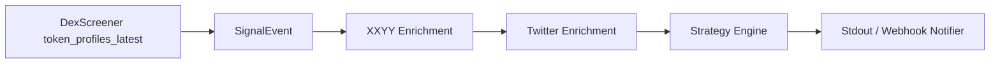

# Signal Trade

面向 `DexScreener paid` 新项目的信号筛选工具。当前实现会监听 `token_profiles_latest`，再聚合 `XXYY` 和 `X/Twitter` 数据，用 JSON 策略只通知符合条件的合约。

当前范围：

- 监听 Dex paid
- 拉取 XXYY 的市值、持币地址人数、KOL、follow 数据
- 拉取 Twitter 社区人数
- 用策略规则过滤
- 输出 `stdout` 或 `webhook` 通知

当前不包含：

- 自动交易
- 止损 / 分批止盈
- 回测

## 模块概览

- `collectors/`
  - DexScreener 与 Twitter/X 的采集层，负责把上游数据标准化成 `SignalEvent`
- `services/`
  - XXYY 与 Twitter community 的补数服务，负责把链上和社媒数据补进策略上下文
- `core/`
  - 应用编排、上下文 enrichment、策略执行
- `models/`
  - `SignalEvent`、`Strategy`、`NotificationPayload` 数据模型
- `notifications/`
  - `stdout` 与 `webhook` 通知输出
- `smoke/` 与 `cli/`
  - 各模块的独立验证入口

## 架构设计

当前实现采用一条很直接的事件流：

```text
DexScreener / Twitter Collector
  -> SignalEvent
  -> Context Enricher
  -> Strategy Engine
  -> Notifier
```

当前主业务链路可以进一步简化成：



各层职责如下：

- `collectors/`
  - 对接上游数据源
  - 当前主要包括：
    - DexScreener WebSocket / REST
    - Twitter/X GraphQL polling
  - 输出统一的 `SignalEvent`

- `models/`
  - 定义统一数据结构
  - 关键模型包括：
    - `SignalEvent`
    - `Strategy`
    - `NotificationPayload`

- `services/`
  - 对接补数型外部服务
  - 当前主要包括：
    - XXYY token / holder / KOL / follow 数据
    - Twitter 用户资料与粉丝数

- `core/enricher.py`
  - 把 `SignalEvent` 转成策略上下文
  - 当前上下文主要由四段组成：
    - `token`
    - `dexscreener`
    - `xxyy`
    - `twitter`
  - 这里负责把：
    - DexScreener `links[]`
    - XXYY `pair/info`
    - XXYY `holders/statInfo`
    - XXYY `holders/kol`
    - XXYY `holders/follow`
    - Twitter profile metrics
      汇总成统一字段

- `core/strategy_engine.py`
  - 按规则执行过滤
  - 支持：
    - 扁平 `entry_conditions / reject_conditions`
    - 递归 `entry_rule / reject_rule`
    - `all / any` 条件组合

- `notifications/`
  - 负责把命中的结果发出去
  - 当前支持：
    - `stdout`
    - `webhook`

- `core/app.py`
  - 负责把 enrichment、strategy、notification 串起来
  - 是运行时的应用编排层

当前主业务链路是：

1. DexScreener 收到 `token_profiles_latest`
2. collector 生成 `SignalEvent`
3. enricher 用 token address 去 XXYY 拉：
   - `pair/info`
   - `holders/statInfo`
   - `holders/kol`
   - `holders/follow`
4. enricher 再从 DexScreener `links[]` 或 XXYY 链接里提取 Twitter 链接
5. Twitter service 拉用户资料，得到 `followers_count`
6. strategy engine 用规则判断是否命中
7. notifier 只输出符合条件的合约

这一版架构是“单进程、同步编排、配置驱动”的最小实现。当前没有引入：

- 消息队列
- 持久化存储
- 回放系统
- 自动交易执行

## 核心逻辑

处理流程：

1. 监听 `dexscreener.token_profiles_latest`
2. 用 token address 到 XXYY 补数据
3. 优先从 DexScreener 事件里的 `links[]` 解析 Twitter 链接
4. 读取 Twitter 账号粉丝数
5. 把数据整理成统一上下文
6. 执行策略规则
7. 只通知命中的合约

当前 `twitter.community_count` 的口径是：

- 项目 Twitter 账号粉丝数

当前 `XXYY` 数据来源拆分为：

- `pair/info`
  - `market_cap`
  - `price_usd`
  - `liquidity`
  - `assistInfo.dexPaid`
  - 接口参数名虽然是 `pairAddress`，但可以直接传 token `mint`
- `holders/statInfo`
  - `holder_count`
  - `follow_buy_count`
  - `kol_buy_count`
  - `insider_holder_count`
- `holders/follow`
  - 关注钱包明细
- `holders/kol`
  - KOL 钱包明细

## 安装

```bash
cd apps/signal-trade
python3 -m venv venv
source venv/bin/activate
pip install -r requirements.txt
cp .env.example .env
```

## 启动前配置

### `.env`

| 变量                   | 必填/可选 | 何时需要                                            | 说明                                                                                       |
| ---------------------- | --------- | --------------------------------------------------- | ------------------------------------------------------------------------------------------ |
| `TWITTER_CT0`          | 必填      | 使用 `twitter.community_count` 时                   | X/Twitter 登录态 cookie                                                                    |
| `TWITTER_AUTH_TOKEN`   | 必填      | 使用 `twitter.community_count` 时                   | X/Twitter 登录态 cookie                                                                    |
| `TWITTER_BEARER_TOKEN` | 可选      | 需要显式覆盖默认 Bearer Token 时                    | 不填时回退到 [config.py](/Users/17a/coding/dev-lab/apps/signal-trade/config.py) 里的默认值 |
| `TWITTER_PROXY_URL`    | 可选      | X/Twitter 访问需要代理时                            | 例如 `http://127.0.0.1:7890`                                                               |
| `XXYY_AUTHORIZATION`   | 可选      | XXYY `follow` / `tag_holder` 等受限接口需要登录态时 | XXYY 鉴权头                                                                                |
| `XXYY_INFO_TOKEN`      | 可选      | XXYY `follow` / `tag_holder` 等受限接口需要登录态时 | XXYY 信息 token                                                                            |
| `XXYY_COOKIE`          | 可选      | XXYY `follow` / `tag_holder` 等受限接口需要登录态时 | XXYY cookie 串                                                                             |

说明：

- `twitter.community_count` 相关策略需要 Twitter 登录态
- 当前 enrichment 默认会在检测到 Twitter 链接时尝试补 Twitter 数据；如果未配置 Twitter 登录态，请求会降级为空值并记录 warning，但不会让主流程直接崩溃
- 如果 XXYY 公开接口已经够用，则不需要配置 XXYY 鉴权项
- 缺少可选配置时，程序会降级，不会直接崩

### `config.json`

复制运行时配置模板：

```bash
cp config.example.json config.json
```

`config.json` 里放：

- `webhookUrl`
- DexScreener 的轮询和连接参数
- Twitter collector 的轮询和默认条数

`config.json` 里都是非敏感运行参数，不是账号凭证。

## 启动方式

以下命令默认都在 `apps/signal-trade` 目录下执行。

查看 CLI：

```bash
python main.py --help
```

一次性拉取 Dex paid：

```bash
python main.py --rules rules.example.json dex-rest --subscriptions token_profiles_latest --limit 5
```

实时监听 Dex paid：

```bash
python main.py --rules rules.example.json dex-ws --subscriptions token_profiles_latest --limit 5
```

单独验证 Twitter polling collector：

```bash
python main.py twitter elonmusk
```

如果只想验证当前项目实际使用的 `twitter.community_count` 链路，推荐直接调用 `TwitterCommunityClient`：

```bash
python3 -c 'import asyncio; from services.twitter_community_client import TwitterCommunityClient; print(asyncio.run(TwitterCommunityClient().fetch_profile_metrics("elonmusk")))'
```

如果需要 webhook，先复制并编辑运行时配置，例如：

```bash
cp config.example.json config.json
```

或者显式传入你自己的配置文件，再这样启动：

```bash
python main.py --rules rules.example.json --config config.json dex-ws --subscriptions token_profiles_latest --limit 5
```

注意：

- `--config` 当前只用于给 `webhookUrl` 这类应用层配置传参
- DexScreener / Twitter 的轮询、超时等运行参数，当前仍由项目根目录下固定的 `config.json` 读取

## 模块测试

当前三个外部模块都可以单独验证：

- DexScreener
  - `python smoke/dexscreener.py --mode rest --limit 5`
  - `python smoke/dexscreener.py --mode ws --subscriptions token_profiles_latest --limit 5`
- XXYY
  - `python smoke/xxyy.py --mint <MINT> --mode pair-info`
  - `python smoke/xxyy.py --mint <MINT> --mode stat-info`
  - `python smoke/xxyy.py --mint <MINT> --mode kol`
  - `python smoke/xxyy.py --mint <MINT> --mode follow`
  - `python smoke/xxyy.py --mint <MINT> --mode context`
- Twitter / X
  - `python cli/twitter_collector_smoke.py`
  - `python cli/twitter_x_poll.py <username>`

## 策略规则

规则文件示例在 [rules.example.json](/Users/17a/coding/dev-lab/apps/signal-trade/rules.example.json)。

当前支持的结构：

```json
{
  "version": 1,
  "globals": {
    "default_chains": ["sol"],
    "notify_channels": ["stdout"]
  },
  "strategies": [
    {
      "id": "paid-sol-early",
      "enabled": true,
      "chains": ["sol"],
      "source": "dexscreener.token_profiles_latest",
      "entry_rule": {
        "logic": "all",
        "conditions": []
      },
      "entry_logic": "all",
      "entry_conditions": [],
      "reject_logic": "any",
      "reject_conditions": [],
      "action": {
        "type": "notify",
        "channels": ["stdout"]
      }
    }
  ]
}
```

规则语义：

- `entry_rule`
  - 递归条件组，支持 `all` / `any` 嵌套
- `entry_conditions`
  - 旧版扁平准入条件，和 `entry_rule` 二选一
- `reject_rule`
  - 递归否决条件组，命中后直接不通知
- `reject_conditions`
  - 旧版扁平否决条件，和 `reject_rule` 二选一
- 没配置的规则 = 不过滤
- 没写进策略的字段 = 不参与判断

支持的操作符：

- `==`
- `!=`
- `>`
- `>=`
- `<`
- `<=`
- `in`
- `contains`
- `exists`
- `contains_any`
- `intersects`

## 当前可用字段

可以在规则里直接使用这些字段：

- `dexscreener.paid`
- `dexscreener.url`
- `dexscreener.icon`
- `dexscreener.header`
- `dexscreener.description`
- `dexscreener.links`
- `token.chain`
- `token.address`
- `token.symbol`
- `xxyy.market_cap`
- `xxyy.holder_count`
- `xxyy.follow_buy_count`
- `xxyy.kol_buy_count`
- `xxyy.follow_or_kol_buy_count`
- `xxyy.follow_addresses`
- `xxyy.kol_addresses`
- `xxyy.follow_names`
- `xxyy.kol_names`
- `twitter.community_count`

当前字段说明：

- `dexscreener.links`
  - 当前直接来自 DexScreener `token-profiles/latest/v1` 返回的 `links[]`
- `xxyy.market_cap`
  - 当前优先来自 XXYY `pair/info.priceInfo.marketCapUSD`
- `xxyy.holder_count`
  - 当前优先来自 XXYY `holders/statInfo.totalHolders`
- `xxyy.follow_buy_count`
  - 当前优先来自 XXYY `holders/statInfo.followedHolders`
- `xxyy.kol_buy_count`
  - 当前优先来自 XXYY `holders/statInfo.kolHolders`
  - 明细回退计数优先按 `buyCount > 0`，不是按当前仍持有
- `xxyy.follow_or_kol_buy_count`
  - 当前等于 `follow_buy_count + kol_buy_count`
- `xxyy.follow_addresses`
  - 当前来自 XXYY `holders/follow[].address`
- `xxyy.kol_addresses`
  - 当前来自 XXYY `holders/kol[].address`
- `xxyy.follow_names`
  - 当前来自 XXYY `holders/follow[].name`
- `xxyy.kol_names`
  - 当前来自 XXYY `holders/kol[].name`
- `twitter.community_count`
  - 当前等于 Twitter 粉丝数
  - Twitter 链接优先来自 DexScreener `links[]`，XXYY 只做兜底

## 示例策略

下面这条策略表示：

- 只看 `sol`
- 必须是 Dex paid
- 必须满足：命中关注钱包白名单 或 命中 KOL 名单
- 持币地址人数至少 100
- 市值大于 300 万不通知
- 持币地址人数大于 5000 不通知

```json
{
  "id": "paid-sol-early",
  "enabled": true,
  "chains": ["sol"],
  "source": "dexscreener.token_profiles_latest",
  "entry_rule": {
    "logic": "all",
    "conditions": [
      { "field": "dexscreener.paid", "op": "==", "value": true },
      {
        "logic": "any",
        "conditions": [
          {
            "field": "xxyy.follow_addresses",
            "op": "contains_any",
            "value": ["AVAZvHLR2PcWpDf8BXY4rVxNHYRBytycHkcB5z5QNXYm"]
          },
          { "field": "xxyy.kol_names", "op": "contains_any", "value": ["ansem", "k4ye"] }
        ]
      },
      { "field": "xxyy.holder_count", "op": ">=", "value": 100 }
    ]
  },
  "reject_logic": "any",
  "reject_conditions": [
    { "field": "xxyy.market_cap", "op": ">", "value": 3000000 },
    { "field": "xxyy.holder_count", "op": ">", "value": 5000 }
  ],
  "action": {
    "type": "notify",
    "channels": ["stdout"]
  }
}
```

## 输出内容

默认通知渠道是 `stdout`。命中时会输出 JSON，包含：

- `strategy`
- `message`
- `event`
- `context`

其中 `context` 是策略判断实际使用的数据。

## 当前限制

- `twitter.community_count` 当前只取粉丝数
- 还没有 Telegram 通知和交易执行

## 代码位置

关键代码：

- 入口：[main.py](/Users/17a/coding/dev-lab/apps/signal-trade/main.py)
- 策略应用：[core/app.py](/Users/17a/coding/dev-lab/apps/signal-trade/core/app.py)
- 策略引擎：[core/strategy_engine.py](/Users/17a/coding/dev-lab/apps/signal-trade/core/strategy_engine.py)
- 数据聚合：[core/enricher.py](/Users/17a/coding/dev-lab/apps/signal-trade/core/enricher.py)
- XXYY client：[services/xxyy_client.py](/Users/17a/coding/dev-lab/apps/signal-trade/services/xxyy_client.py)
- Twitter 社区数据：[services/twitter_community_client.py](/Users/17a/coding/dev-lab/apps/signal-trade/services/twitter_community_client.py)
